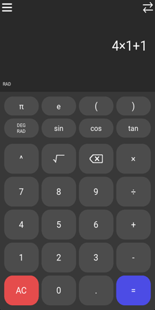
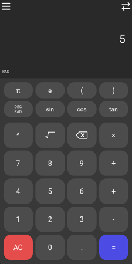
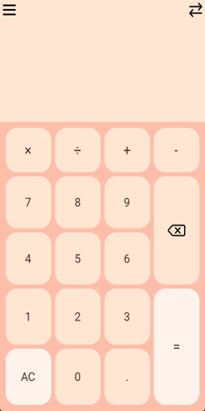
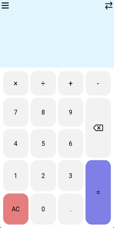

# Carlculator App
This simple calculator app is a hobby project of mine to learn app programming in Python using Kivy Language. Can you find all easter eggs?

 

# Installation
To install this app on your Android mobile device, go to [releases](https://github.com/carlbodin/carlculatorapp/releases), choose the latest, and download the APK. Make sure that you have enabled the permission to install apps outside of Google Play Store, see setting "Install unknown apps", for the app you are launching the APK from. The APK can be deleted after installation. Enjoy!

## Build
Build Android App APK from project source code with Buildozer. NB this cannot be done in a Windows environment. If you're on Windows OS you could use, e.g., WSL. 

Install Buildozer, see docs [here](https://buildozer.readthedocs.io/en/latest/installation.html) for important requirements. Make sure your java default path matches the one in the docs I just linked. Set its path in *~/.bashrc*. I built with python 3.8, kivy 2.3.0, gradle 8.0.2, and openjdk-17.

Use my *buildozer.spec* file, or create your own, in the project folder using `buildozer init` in the terminal. Compile using the command `buildozer -v android debug`. This will take some time during the first run. At the end, you should have an APK file in the *bin/* directory.

## License
Free to use.
